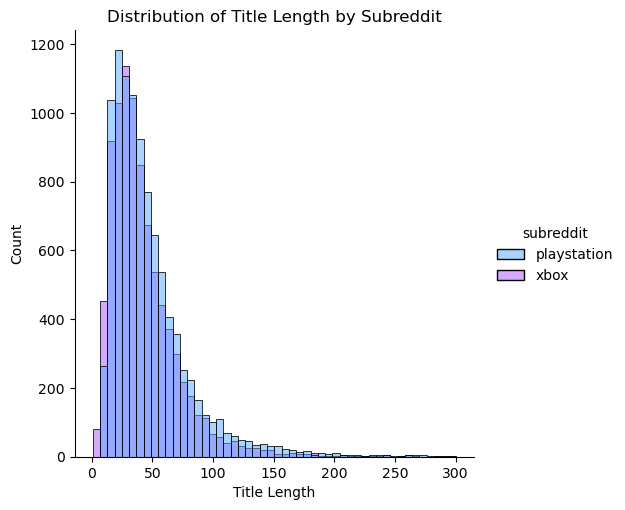
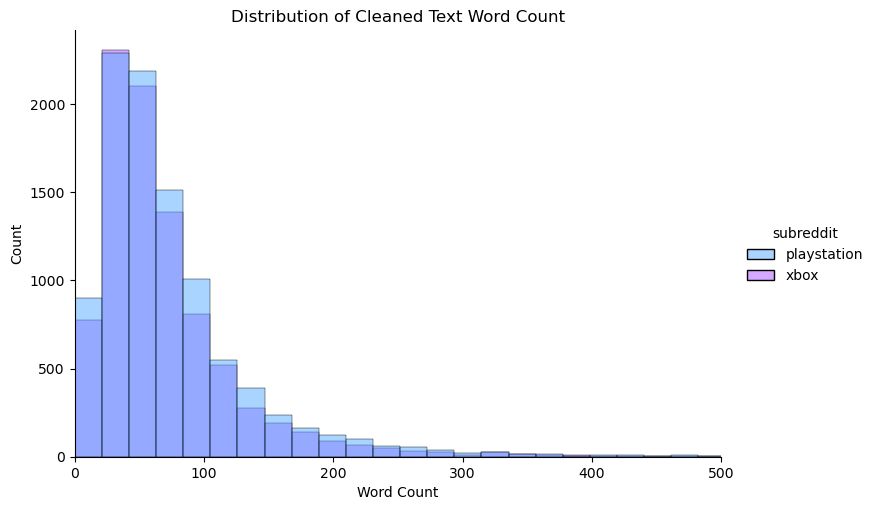
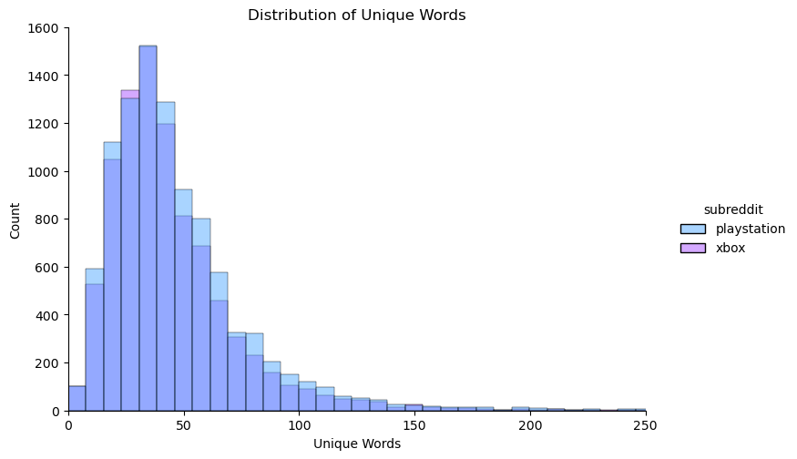

# Kotaku Video Game Post Classification

## Executive Summary

[Kotaku](https://kotaku.com/) is a leading site for news, reviews, and more relating to the world of video games.  As a leader in this space, the amount of activity on the site has continued to increase.  According to the World Economic Forum, by 2025, it’s estimated that 463 exabytes of data will be created each day globally, equivalent to over 212 million DVDs per day, so Kotaku is not alone in seeing this growth. [(source)](https://www.weforum.org/agenda/2019/04/how-much-data-is-generated-each-day-cf4bddf29f/)  Being committed to this market, Kontaku also knows that ensuring information is classified correctly can have a big impact on how users experience the site and the content it has to offer.  They have also seen first-hand that the cost of manually classifying and moderating posts and comments has continued to increase as the amount of data increases.

As these costs have increased, Kotaku believes that some automation to improve efficiency is required to sustain their growth.  Due to the topic-specific nature of the classifications performed on a normal basis, there is interest in creating some specific tools to aid in post and comment classification, which falls under the umbrella of moderation.  Before committing too many resources to this effort, Kotaku desired a proof-of-concept (POC) to see how well a classification model may work specifically focused on video game platforms. They felt if this initial result can be accurate 75% of the time, it would be worthwhile to continue the cost-benefit analysis of a more automated approach.

With the increased popularity and accessibility to machine learning models over the years, it is possible to create and train models for specific purposes, such as this. In order to prove that a model could be built for this purpose, data from specific user-based forums targeted on very specific video game platforms was used.  In this case, data from Reddit focused on the Playstation and Xbox subreddits was used in order to provide examples of real-world, uncensored posts. To ensure that any models developed would be more robust, during the course of this project, attempts were made to remove specific brand and keyword information that may make the posts easier to classify.  The overall aim is to make sure the model is as accurate as possible with its predictions, to try and meet or exceed the 75% target.  Kotaku can use the information gathered from this POC to analyze potential time and cost savings relating to their moderation team to gauge the feasibility of using a model-based approach to assist with their classification and moderation challenges.

After assessing various models throughout this project, the model that was selected for this POC yielded an accuracy of 82% when classifying posts from the data.  Since that exceeds the 75% target, Kotaku should consider this accuracy when analyzing their economic needs for continued investment in a more automated approach to moderation.  It is possible that the model could be refined and improved with other techniques that were not explored during this POC due to the time contraints.  This should, however, provide a reasonable idea of what could be expected from a model focused on classification by video game platform.

## Description of Data
### Files:
* [`playstation.csv`](./data/playstation.csv): A collection of over 10k posts from the r/playstation subreddit.
 ([source](https://git.generalassemb.ly/dpfay/p3_datasets/blob/main/data/playstation.csv))

* [`xbox.csv`](./data/xbox.csv): A collection of over 10k posts from the r/xbox subreddit.
 ([source](https://git.generalassemb.ly/dpfay/p3_datasets/blob/main/data/xbox.csv))
 
 * [`reddit_cleaned.csv`](./data/reddit_cleaned.csv): Combined file created after data was cleaned and transformed for NLP to be used for the basis of EDA and Modeling.
 

### Data Dictionary
DataFrames:
- `ps` Used for cleaning and processing the r/playstation subreddit data.
- `xb` Used for cleaning and processing the r/xbox subreddit data.
- `df` Combined subreddit data, used in EDA and Modeling.

In addition to the original data descriptions from the link above, please note the following details:

|Feature|Type|Description|
|---|---|---|
|**subreddit**|*string*|Name of subreddit for post|
|**id**|*string*|alphanumeric post id value|
|**author**|*string*|Username for author|
|**num_comments**|*int*|Number of comments on post|
|**selftext**|*string*|Body text of the post|
|**title**|*string*|Title text of the post|
|**upvote_ratio**|*float*||
|**url**|*string*|Url to the post|
|**text**|*string*|Combined text from `selftext` and `title`|
|**title_len**|*int*|Total characters in title|
|**text_word_count**|*int*|Word count of `text`|
|**text_unique_words**|*int*|Unique word count of `text`|
|**target**|*int*|Used in modeling, converted `subreddit` to binary value 1=playstation|

## Modeling Approach
Below is a summary of the steps in this project, broken down by notebook.  The noteboooks contain more detail and are available in this repo in the [code folder](./code/), or you can click on their title below:

### [`01_Data_Cleaning`](./code/01_Data_Cleaning.ipynb)
Data was imported from the source files, it was cleaned of null/empty values, and any posts that had deleted bodies or titles, to ensure that we complete posts to use for analysis and model training. After those posts were treated there were still over 18,000 records split fairly evenly (52% / 48%). Text from post titles and bodies were combined into a single feature.  This combined feature was prepared for NLP by removing URLs, punctuation, additional spaces, and lowering the case of the text.  In addition, Spacy lemmatization was used to get the root words and help the modeling.

In addition, since this data was pulled from r/playstation and r/xbox subreddits in order to make the model more robust, certain keywords were removed: `'playstation', 'xbox', 'ps', 'ps2', 'ps3', 'ps4', 'ps5', 'sony', 'microsoft'` Numbers were removed from the text, but due to some of the content mentioning significant terms such as '1080p' or '4K', the data was treated in such a way to leave those values in the text for training the model.

### [`02_EDA`](./code/02_EDA.ipynb)

During this analysis phase, the data was examined in various ways.  Certain attributes about the data were calculated, such as the title length, character count of the comined clean text, and the number of unique words contained therein.  The main goal was trying to determine if there were significant differences in those aspects of the data between the two subreddits that may hinder the model performance.  What was found is that the characteristic makeup of the data was fairly similar:

In this plot, you can see the distribution of the title lengths, by subreddit.  You can see that the playstation subreddit had more volume, but the shape of the distributions is very similar between these two different topics.
 

 

Here, a similar observation can be made where the playstation subreddit had higher counts, but the shape between the two subreddits is very close to each other.
 

 

This pattern continued, even in the unique word count.  Seeing these patterns at this phase was a bit concerning since I thought this might impact the model performance, although for this particular approach using NLP there shouldn't be a big impact to the model.

The number of unique authors was also examined in an effort to see if there might be any issues with the model if there was a similar post count but drastically different author count, then the author may re-use multiple words or phrases in their writing and impact the performance of the model.  Here again, the counts were relatively close:
- Playstation: 8,003 authors of 9,753 posts
- Xbox: 7,539 authors of 8,873 posts

### [`03_Modeling`](./code/03_Modeling.ipynb)

The first step taken in modeling was to calculate the baseline, which in a case of binary classification, it is just the percentage of the majority class, in this project that was playstation at 52.4%.  This means that if any model accuracy is 52.4% it is adding no predictive value.

    
With the baseline established, various models were tested such as Decision Tree, Random Forest, k-Nearest Neighbors, and Logistic Regression.  In order to select a model to tuning for the eventual production model for this project, each model underent the following:
- Configure a pipeline with a CountVectorizer
- Configure a pipeline with a TfidfVectorizer
- Get model scores on train and test data with default settings
- Attempt two GridSearch to see how much model performance would change with different hyperparameters
    
After having the results from these various models, the best performing model that was also compatible with type of data we had, was selected.  In this case the Random Forest classifier with the CountVectorizer was selected.  This combination went through some additional rounds of tuning and then used to make predications for evaluation.
    
The evaluation looked at various aspects of the model by generating a classification report, a confusion matrix, and a ROC AUC plot.  These details can be found in the notebook.  Overall, after tuning the model is scoring an 82% accuracy score.  

Due to the number of false positives shown in the confusion matrix, some additional investigation went in to examining the cleaned text of posts that were misclassified and had a probability of 70% or higher in the opposite class.  When that text was examined, it was mostly related to fairly generic terminology regarding "account" and "pre order" which could easily appear in either subreddit and would make it difficult for the model to distinguish.
    

## Conclusions and Next Steps

The modeling that was performed improved the accuracy from a 52% baseline accuracy, given the majority class, to 82% accuracy with the chosen Random Forest model after tuning.  This exceeds the 75% target for Kontaku, so they should proceed with the remainder of their analysis.  This proof-of-concept model should give them a good data point to use when performing some additional internal analysis about the cost-benefit of moving towards a more automated and scalable classification and moderation approach.

### Next Steps
For potential next steps relating to this effort, I would put forward:
1. Proceed with cost-benefit analysis
2. Model improvement
    - Look at additional techniques, such as boosting, stacking, and sentiment analysis to see if the model performance can be improved
3. Evaluate the cost of model deployment
    - Having the model is great, but there will be other costs relating to putting this model into production, which should be understood by Kotaku in order to make the best business decision they can